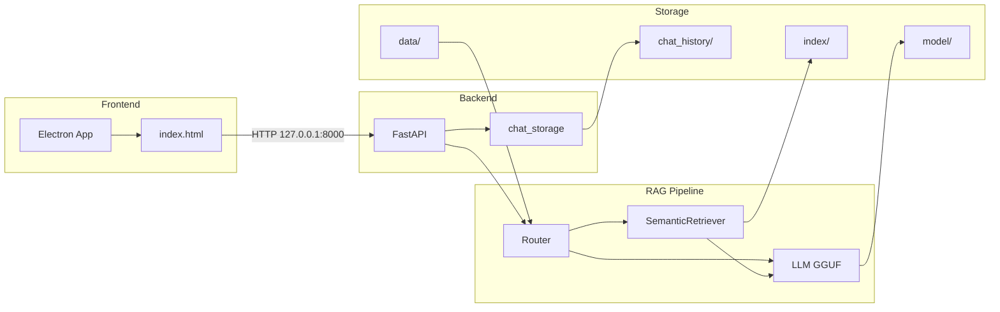
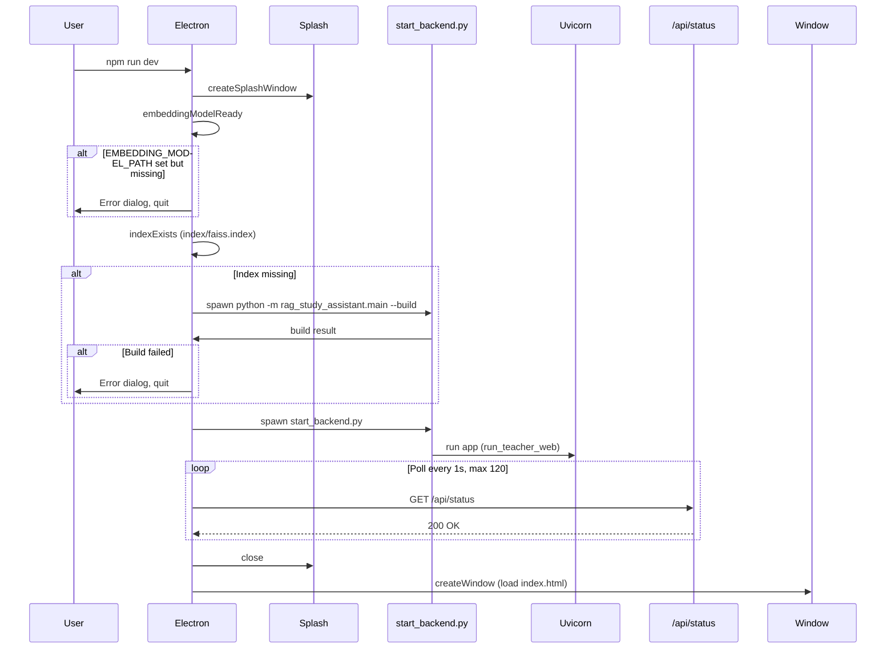
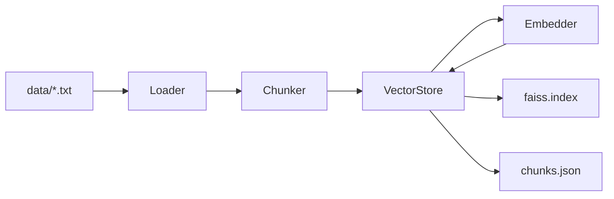
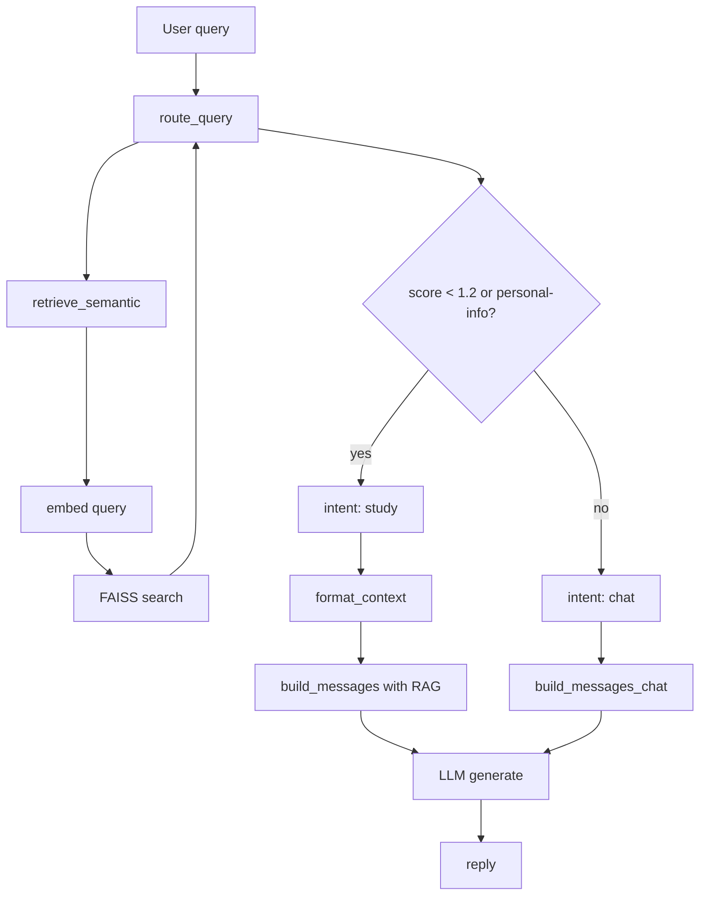
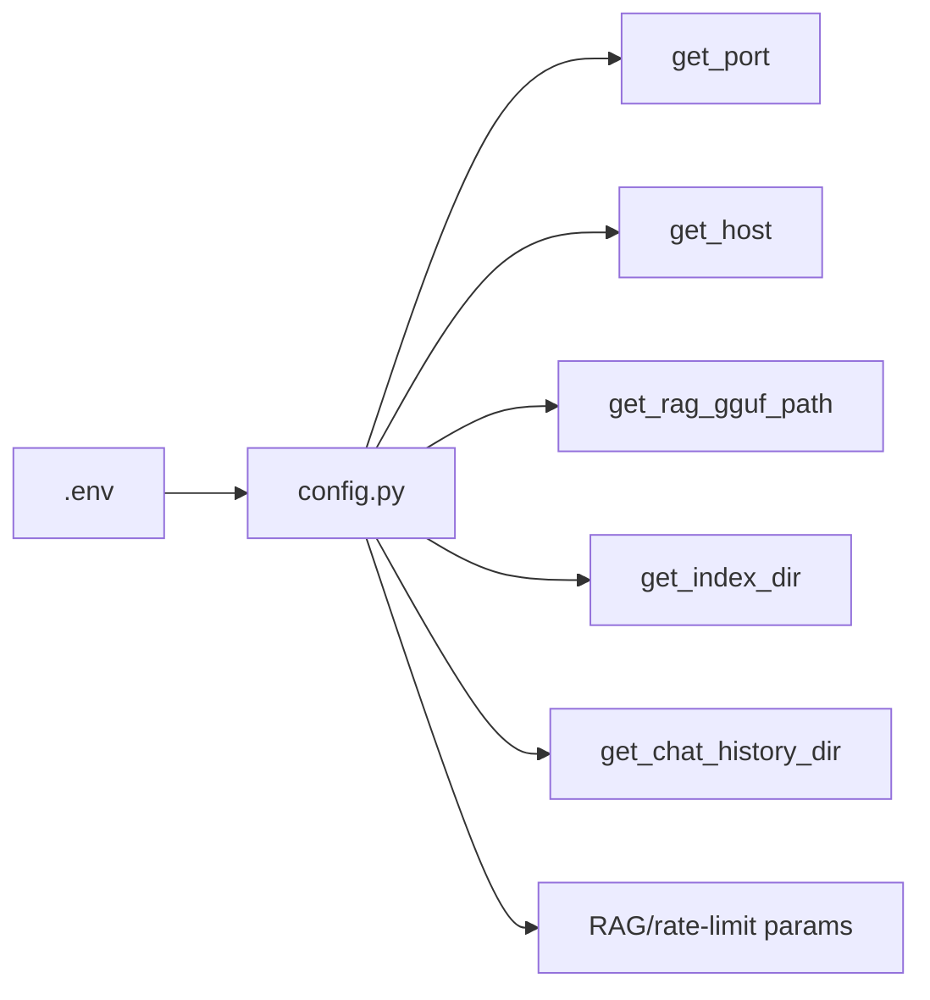

# RatioEdu – Project Architecture and Data Flow

This document describes how the Ratio_Ai (RatioEdu) project works end-to-end: the Electron frontend, FastAPI backend, and RAG (Retrieval-Augmented Generation) pipeline.

---

## Introduction

**RatioEdu** is a desktop RAG study assistant that runs fully offline. It consists of:

- **Electron frontend** – Single-window desktop app with a chat UI (sidebar for chat list, main area for messages and input, document upload).
- **FastAPI backend** – HTTP API on `127.0.0.1` (default port 8000) for chat, chat history CRUD, document upload, and index rebuild. Served by **uvicorn**.
- **RAG pipeline** – Documents (`.txt` under `data/syllabus`, `data/notes`, `data/question_papers`) are chunked, embedded, and stored in a **FAISS** index. At query time, the **router** decides between “study” (RAG over notes) and “chat” (general assistant). A local **GGUF** LLM (via llama-cpp-python) generates replies.

There is no database: chat history is stored in `chat_history/chats.json`; the RAG index lives in `index/faiss.index` and `index/chunks.json`. Configuration is read from `.env` and exposed via `config.py`.

---

## High-Level Architecture



- **Electron** loads `index.html` and talks to the backend over HTTP.
- **FastAPI** handles all API routes, rate limiting, and CORS; it uses **chat_storage** for persistence and **RAG** (router → retriever → LLM) for chat.
- **Storage**: `data/` for uploaded documents, `index/` for FAISS + chunks, `chat_history/` for chats, `model/` for GGUF files.

---

## Startup Sequence

When you run `npm run dev` (or `npm start`), Electron starts and brings up the backend before showing the main window.



- **Splash** shows “RatioEdu – Loading...” while checks run.
- **embeddingModelReady**: if `.env` sets `EMBEDDING_MODEL_PATH`, that path must exist.
- **indexExists**: if `index/faiss.index` is missing, Electron runs `python -m rag_study_assistant.main --build` once.
- **startBackend**: spawns `start_backend.py`, which runs uvicorn with the FastAPI app.
- **waitForServer**: polls `GET http://127.0.0.1:8000/api/status` until 200 (up to ~2 minutes).
- Then the splash is closed and the main window loads `electron_app/index.html`.

---

## Backend (FastAPI)

| Item | Description |
|------|-------------|
| **Entry (Electron)** | [start_backend.py](../start_backend.py) – sets `PORT` default 8000, imports `app` from `run_teacher_web`, runs `uvicorn.run(app, host=config.get_host(), port=config.get_port())`. |
| **App** | [run_teacher_web.py](../run_teacher_web.py) – `FastAPI(title="RatioEdu")`, CORS (allow all origins/methods/headers), rate limiting per client IP. |
| **Rate limit** | Configurable via config (e.g. 60 requests per 60 seconds per IP). Enforced in `api_chat` using a deque per client. |

**Pydantic models (in run_teacher_web.py):**

- **ChatRequest**: `message: str`, `history: list[dict] | None`
- **ChatResponse**: `reply: str`
- **ChatBody**: `id`, `title`, `messages`, `createdAt` (all optional) – used for create/update chat.

**Routes** are listed in the API reference below. The backend lazily initializes the RAG backend on first use via `_get_backend()` (calls `get_rag_backend(project_root)` from `rag_study_assistant.main`).

---

## API Reference

| Method | Path | Description | Request / Response |
|--------|------|-------------|--------------------|
| GET | `/` | Landing page | HTML: “Use the Electron desktop app. API: …” |
| GET | `/api/status` | Health / backend name | Response: `{ "backend": "RatioEdu AI" }` or `{ "backend": null, "error": "…" }` |
| POST | `/api/chat` | Send message, get reply | Body: `ChatRequest` (message, history). Response: `ChatResponse` (reply). Rate-limited. |
| GET | `/api/chats` | List all chats | Response: `{ "chats": [ { id, title, messages, createdAt }, … ] }` |
| GET | `/api/chats/{chat_id}` | Get one chat | Response: chat object or 404 |
| POST | `/api/chats` | Create chat | Body: `ChatBody`. Response: created chat (id generated if not provided). |
| PUT | `/api/chats/{chat_id}` | Update chat | Body: `ChatBody` (title and/or messages). Response: updated chat or 404 |
| DELETE | `/api/chats/{chat_id}` | Delete chat | Response: `{ "ok": true }` or 404 |
| POST | `/api/upload-document` | Upload .txt | Form: `file` (file), `document_type` ("syllabus" or "notes"). Saves under `data/{type}/`, rebuilds RAG index, invalidates cached backend. Response: `{ "ok": true, "path": "…" }` |
| POST | `/api/rebuild-index` | Rebuild RAG index | No body. Rebuilds from `data/`, then invalidates cached backend. Response: `{ "ok": true }` or 500 |

**Frontend usage** ([electron_app/index.html](../electron_app/index.html), [electron_app/main.js](../electron_app/main.js)):

- **main.js**: `GET /api/status` for `waitForServer`.
- **index.html**: `GET /api/chats`, `POST /api/chats`, `PUT /api/chats/{id}`, `DELETE /api/chats/{id}`, `POST /api/chat`, `POST /api/upload-document` (FormData with `file` and `document_type`). Base URL is `http://127.0.0.1:8000` (PORT 8000).

---

## Request Flow: Chat

End-to-end path when the user sends a message in the UI.

```mermaid
sequenceDiagram
  participant User
  participant UI as Electron UI
  participant API as POST /api/chat
  participant RateLimit
  participant GetBackend as _get_backend
  participant Route as route_query
  participant Retriever as SemanticRetriever
  participant Router as study vs chat
  participant BuildMsg as build_messages
  participant LLM
  participant Response as ChatResponse

  User->>UI: Send message
  UI->>API: POST /api/chat (message, history)
  API->>RateLimit: _check_rate_limit(client_ip)
  RateLimit-->>API: OK or 429
  API->>GetBackend: get_rag_backend()
  GetBackend-->>API: get_reply / get_reply_with_history
  API->>Route: route_query(msg, index_dir)
  Route->>Retriever: retrieve_semantic(query, k=5)
  Retriever-->>Route: chunks, score
  Route-->>API: intent "study" or "chat", chunks
  API->>Router: intent study -> format_context + build_messages; else build_messages_chat
  Router->>BuildMsg: build_messages(msg, context, history) or build_messages_chat(msg, history)
  BuildMsg-->>API: messages
  API->>LLM: generate(llm, messages)
  LLM-->>API: reply text
  API->>Response: ChatResponse(reply=...)
  Response-->>UI: JSON
  UI->>User: Show reply
```

- **route_query** ([app/router.py](../app/router.py)): uses semantic retrieval + distance threshold (1.2) and personal-info regex; “study” uses RAG context, “chat” uses only conversation.
- **get_reply** / **get_reply_with_history** are returned by `get_rag_backend()` in [rag_study_assistant/main.py](../rag_study_assistant/main.py); they call `route_query`, then either RAG or chat prompt construction, then `generate()` in [rag_study_assistant/llm.py](../rag_study_assistant/llm.py).

---

## RAG Pipeline

### Index build

Triggered by:

- CLI: `python -m rag_study_assistant.main --build`
- After `POST /api/upload-document` or `POST /api/rebuild-index` (both call `build()` in `rag_study_assistant.main`).



- **Loader** ([rag_study_assistant/loader.py](../rag_study_assistant/loader.py)): reads `.txt` from `data/syllabus`, `data/notes`, `data/question_papers`; infers type, chapter, subject from paths.
- **Chunker** ([rag_study_assistant/chunker.py](../rag_study_assistant/chunker.py)): splits documents (e.g. 400 tokens, 50 overlap).
- **VectorStore** ([app/vector_store.py](../app/vector_store.py)): uses [app/embedder.py](../app/embedder.py) to embed chunk texts, builds FAISS index, writes `index/faiss.index` and `index/chunks.json`.

### Query path (study vs chat)

For each user message, the backend routes to “study” (RAG) or “chat” (no RAG context), then generates a reply.



- **retrieve_semantic** ([app/semantic_retriever.py](../app/semantic_retriever.py)): loads FAISS index and chunks from `index_dir`, embeds the query, runs FAISS search, returns top-k chunks and best distance.
- **route_query** ([app/router.py](../app/router.py)): if the query matches personal-info patterns, returns "study"; else if best distance < 1.2 returns "study", else "chat".
- **study**: context from chunks is formatted and passed into `build_messages` (RAG system prompt + notes + question) in [rag_study_assistant/main.py](../rag_study_assistant/main.py).
- **chat**: `build_messages_chat` (general assistant system prompt + history + question).
- **generate** ([rag_study_assistant/llm.py](../rag_study_assistant/llm.py)): llama-cpp-python `create_chat_completion`, then reply cleaning.

---

## Frontend (Electron)

- **Stack**: Electron; UI is a single HTML file ([electron_app/index.html](../electron_app/index.html)) with CSS and inline JavaScript. No React/Vue or client-side router.
- **Process lifecycle** ([electron_app/main.js](../electron_app/main.js)):
  - On `app.whenReady()`: show splash, run embedding/index checks, optionally run RAG `--build`, spawn `start_backend.py`, wait for `GET http://127.0.0.1:8000/api/status`, then create the main window and load `index.html`.
  - On `before-quit`: kill the backend process.
- **UI**: Sidebar (new chat, chat list, upload document); main area (welcome state, message list, input). All API calls use `fetch` to `http://127.0.0.1:8000` (PORT 8000 in main.js).

---

## Data and Configuration

### Data locations

| Path | Purpose |
|------|--------|
| `chat_history/chats.json` | List of chat objects (`id`, `title`, `messages`, `createdAt`). Read/written by [app/chat_storage.py](../app/chat_storage.py). |
| `index/faiss.index` | FAISS vector index built from chunk embeddings. |
| `index/chunks.json` | Chunk metadata and text; same order as FAISS indices. |
| `data/syllabus`, `data/notes`, `data/question_papers` | Uploaded and placed `.txt` files; source for RAG build. |
| `model/` | GGUF model files (LLM and optionally embedding). |

### Configuration



- **.env**: Loaded by [config.py](../config.py) (via dotenv). Defines e.g. `PORT`, `HOST`, `DEFAULT_GGUF_FILENAME`, `RAG_GGUF_PATH`, `EMBEDDING_MODEL_PATH`, `INDEX_DIR`, `CHAT_HISTORY_DIR`, `N_GPU_LAYERS`, `RAG_N_CTX`, `TEMPERATURE`, `MAX_TOKENS`, `MAX_MESSAGE_LENGTH`, `RATE_LIMIT_REQUESTS`, `RATE_LIMIT_WINDOW_SEC`.
- **config.py**: Exposes getters used by [run_teacher_web.py](../run_teacher_web.py), [start_backend.py](../start_backend.py), [rag_study_assistant/main.py](../rag_study_assistant/main.py), [app/chat_storage.py](../app/chat_storage.py), and RAG/embedder/LLM code. When run as PyInstaller exe, project root is taken from the executable directory.

---

## Security and Limits

- **No authentication**: The API does not implement login, sessions, or tokens. It is intended for local use only.
- **Binding**: Backend listens on `127.0.0.1` by default (configurable via `HOST` in .env), so it is not exposed to the network unless explicitly configured.
- **Rate limiting**: Applied only to `POST /api/chat`; per client IP, configurable via `RATE_LIMIT_REQUESTS` and `RATE_LIMIT_WINDOW_SEC` in config. Returns 429 when exceeded.
- **Upload**: Only `.txt` files are accepted for `document_type` "syllabus" or "notes"; filenames are sanitized before writing to disk.

---

## Key File Reference

| Layer | File | Role |
|-------|------|------|
| Backend entry | [start_backend.py](../start_backend.py) | Runs FastAPI app with uvicorn (used by Electron). |
| Backend app | [run_teacher_web.py](../run_teacher_web.py) | FastAPI app, routes, rate limit, RAG backend wiring. |
| Config | [config.py](../config.py), `.env` | All settings and paths. |
| RAG | [rag_study_assistant/main.py](../rag_study_assistant/main.py) | `build()`, `get_rag_backend()`. |
| Routing | [app/router.py](../app/router.py) | `route_query()` (study vs chat). |
| Retrieval | [app/semantic_retriever.py](../app/semantic_retriever.py) | FAISS + chunks load and search. |
| Index build | [app/vector_store.py](../app/vector_store.py), [app/embedder.py](../app/embedder.py) | Build FAISS index and chunks.json. |
| Loader/Chunker | [rag_study_assistant/loader.py](../rag_study_assistant/loader.py), [rag_study_assistant/chunker.py](../rag_study_assistant/chunker.py) | Load and chunk documents from data/. |
| LLM | [rag_study_assistant/llm.py](../rag_study_assistant/llm.py) | Load GGUF, `generate()` for completion. |
| Chat persistence | [app/chat_storage.py](../app/chat_storage.py) | Load/save/delete chats in chat_history/chats.json. |
| Frontend | [electron_app/main.js](../electron_app/main.js) | Electron main process, backend spawn, window. |
| Frontend UI | [electron_app/index.html](../electron_app/index.html) | Single-page chat UI, fetch to backend. |
